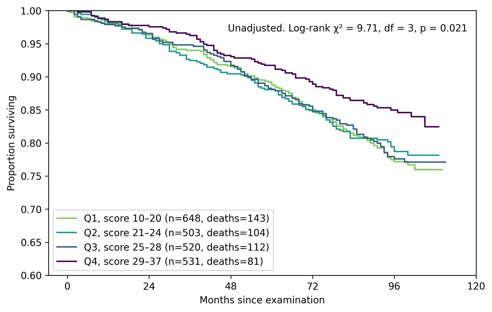
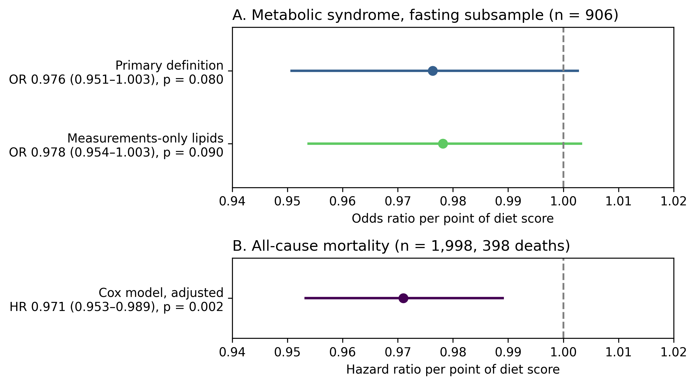

# Diet Quality, Metabolic Risk and Survival in Adults 50+ (NHANES 2011–2012)

## Summary

## Why this question

## Data and population

### Population

The analysis uses the 2011–2012 cycle of the National Health and Nutrition Examination Survey (NHANES), run by the US National Center for Health Statistics (NCHS), restricted to participants aged 50 and over. This cycle was chosen because NCHS links its participants to death records through the end of 2019 in a public-use mortality file, giving roughly eight years of follow-up. More recent cycles have too little follow-up for a survival analysis.

Diet is measured by the first-day 24-hour dietary recall. Participants are kept only if NHANES flags their recall as reliable (`DR1DRSTZ = 1`), and then only if their reported energy intake is plausible by the Willett cut-offs: 500–3,500 kcal for women, 800–4,000 kcal for men. The energy step removes 100 participants, 4.3% of those with a reliable recall.

### Sample flow

```
NHANES 2011–2012 participants                          9,756
  → aged 50 and over                                   2,704
  → record in the dietary file                         2,566
  → reliable recall (DR1DRSTZ = 1)                     2,306
  → plausible energy intake                            2,206   analytic sample
      │
      ├─ fasting glucose and triglycerides measured    1,015
      │    └─ complete covariates                        906   metabolic syndrome models,
      │                                                        prediction benchmark
      │
      └─ linked to mortality records                   2,202   440 deaths
           └─ complete covariates                      1,998   398 deaths, Cox model
```

The analytic sample of 2,206 divides according to what each analysis needs. The metabolic syndrome outcome requires fasting glucose and triglycerides, which 1,015 participants have; 906 of them have complete data on the model covariates, and the prediction benchmark uses the same 906. The survival analysis has no fasting requirement: it uses all 2,202 participants NCHS could link to mortality records (4 could not be linked for insufficient identifying data), of whom 440 (20.0%) died during follow-up. Among those still alive at the end of follow-up, the median follow-up is 96 months. By Kaplan–Meier estimate, 96.5% of the sample were alive at 2 years, 89.1% at 5 years and 79.5% at 8 years. The Cox model's complete cases number 1,998, with 398 deaths.

Almost all the loss at the complete-case steps is from missing household income: 104 of the 109 participants dropped from the metabolic syndrome models, and 198 of the 204 dropped from the Cox model. Methods describes how those dropped compared with those kept.

### Data files

The data are not redistributed in this repository. They are free to download from NCHS, and their use is governed by the [NCHS Data User Agreement](https://www.cdc.gov/nchs/policy/data-user-agreement.html), which a user accepts on download. The notebook reads the twelve files below from a folder named `data/` at the top level of the project.

| File | Contents | SHA-256 |
|---|---|---|
| [`BMX_G.xpt`](https://wwwn.cdc.gov/nchs/nhanes/search/datapage.aspx?Component=Examination&Cycle=2011-2012) | Body measures | `4814bfc3047ed400b9d43d285f8c3ea7c940ac6489404a9b699579715d158ec3` |
| [`BPQ_G.xpt`](https://wwwn.cdc.gov/nchs/nhanes/search/datapage.aspx?Component=Questionnaire&Cycle=2011-2012) | Blood pressure and cholesterol medication questions | `39c5a0ee1d76e6f3df867c0057986a21f4a028038002c43214c5af8bdec83cae` |
| [`BPX_G.xpt`](https://wwwn.cdc.gov/nchs/nhanes/search/datapage.aspx?Component=Examination&Cycle=2011-2012) | Blood pressure readings | `1dd66110f41465d601cd54f1e3c6010baafb9375f09fbcaa3aef2536876146fd` |
| [`DEMO_G.xpt`](https://wwwn.cdc.gov/nchs/nhanes/search/datapage.aspx?Component=Demographics&Cycle=2011-2012) | Demographics | `eaf0525d1952626885af3e935415a1f66ad62c18698080e7354789c125af252d` |
| [`DIQ_G.xpt`](https://wwwn.cdc.gov/nchs/nhanes/search/datapage.aspx?Component=Questionnaire&Cycle=2011-2012) | Diabetes questions | `a9d5475e0cd66d6a7bc30230345ed0172a9abcbc0a7a4145a35025c827a52a87` |
| [`DR1TOT_G.xpt`](https://wwwn.cdc.gov/nchs/nhanes/search/datapage.aspx?Component=Dietary&Cycle=2011-2012) | First-day total nutrient intakes | `d5589de4cd987eef86dd13b3b2bc3db9186ab80a87c96a3968421ddef9235c57` |
| [`GHB_G.xpt`](https://wwwn.cdc.gov/nchs/nhanes/search/datapage.aspx?Component=Laboratory&CycleBeginYear=2011) | Glycohemoglobin (HbA1c) | `8ff7cc95461fdfd47d2c9640b944a2bcd45926a3c0e64c98a09a4cef6c0f88d7` |
| [`GLU_G.xpt`](https://wwwn.cdc.gov/nchs/nhanes/search/datapage.aspx?Component=Laboratory&CycleBeginYear=2011) | Fasting glucose | `e9c3816dbdfc21cd53a23d63c3610d2550662ee41a21df0a5b72c4a16cd1a8fd` |
| [`HDL_G.xpt`](https://wwwn.cdc.gov/nchs/nhanes/search/datapage.aspx?Component=Laboratory&CycleBeginYear=2011) | HDL cholesterol | `ffc060d394cc487f3206462fdfc77648bdbdd6e279bfc5dd8e9cbba3ccdcac4f` |
| [`SMQ_G.xpt`](https://wwwn.cdc.gov/nchs/nhanes/search/datapage.aspx?Component=Questionnaire&Cycle=2011-2012) | Smoking questions | `69f2375f036a815082b1e97110e79c505b91e0985c61696f8eaacf94828115dc` |
| [`TRIGLY_G.xpt`](https://wwwn.cdc.gov/nchs/nhanes/search/datapage.aspx?Component=Laboratory&CycleBeginYear=2011) | Triglycerides | `4b7f9c73f5169f8bb582823d00a8e488d6985ea9d8784f85ee63ff60179589a0` |
| [`NHANES_2011_2012_MORT_2019_PUBLIC.dat`](https://ftp.cdc.gov/pub/Health_Statistics/NCHS/datalinkage/linked_mortality/) | Public-use linked mortality file (fixed-width text) | `ff98b6c87172643426b1c6d20f76495592bebd618ea18f742d98a44b84456b30` |

To check that downloaded files are identical to the ones this analysis used, run this in the folder that holds them (tested on macOS, zsh):

```
shasum -a 256 *.xpt *.dat
```

Each fingerprint in the output should match the table. The files are listed in the same order as the table.

### Mortality data

The mortality file comes from the NCHS public-use linked mortality files, which follow NHANES participants' vital status through the end of 2019. It is downloaded from the [NCHS linked mortality FTP directory](https://ftp.cdc.gov/pub/Health_Statistics/NCHS/datalinkage/linked_mortality/), which NCHS names as the authentic source of these files. Its fixed-width layout is described in the [NCHS data dictionary](https://www.cdc.gov/nchs/data/datalinkage/public-use-linked-mortality-files-data-dictionary.pdf).

The data are cited as NCHS asks:

> National Center for Health Statistics Division of Analysis and Epidemiology. Continuous NHANES Public-use Linked Mortality Files, 2019. Hyattsville, Maryland. Available from: `https://www.cdc.gov/nchs/data-linkage/mortality-public.htm`. doi:10.15620/cdc:117142.

The web page named in the citation now redirects to a general National Death Index page, so the FTP directory above is given as the download source and the DOI as the permanent identifier.

**Acknowledgement and disclaimer.** The linked mortality data are provided by the National Center for Health Statistics. The analyses, interpretations and conclusions in this repository are the author's alone; NCHS is responsible only for the initial data.

## Methods

The analysis is built in four layers, each completed before the next began:

1. **Diet quality score:** a nutrient-based score from the 24-hour dietary recall.
2. **Diet and metabolic syndrome:** cross-sectional logistic regression.
3. **Diet and mortality:** Kaplan–Meier curves and a Cox proportional hazards model over about eight years of follow-up.
4. **Prediction benchmark:** whether a flexible model predicts metabolic syndrome better than logistic regression.

### Diet quality score

The score follows the logic of DASH-style indices. Eight nutrients are scored: five that a healthy diet should be high in are rewarded (fibre, potassium, magnesium, calcium and vitamin C), and three it should be low in are penalised (sodium, saturated fat and total sugars). A nutrient-based index with published precedent was preferred to an invented one.

Each nutrient is first expressed as a density per 1,000 kcal, so that the score reflects what a diet is made of rather than how much was eaten. Densities are then divided into quintiles within the analytic sample and scored 1 to 5, reversed for the penalised nutrients so that a higher score always means a better diet. The eight component scores are summed with equal weight, giving a possible range of 8 to 40. The observed range is 10 to 37 (mean 24.0, SD 5.56).

Equal weighting was checked rather than assumed: no pair of components correlates above 0.8 (the highest, potassium with magnesium, is 0.71), so no component duplicates another.

Two candidate components were left out. Carotenoid intake on a single day depends heavily on whether a carotenoid-rich food happened to be eaten, so one recall ranks people's usual intake poorly. Protein does not distinguish diet quality without information on its food sources: 80 g from processed meat would score the same as 80 g from legumes.

Energy adjustment by density was chosen over the residual method (regressing each nutrient on total energy), which is equally standard but harder for a non-specialist to follow. A re-run with the residual method is deferred.

### Metabolic syndrome

Metabolic syndrome is defined by the harmonised criteria: a participant has it if they meet three or more of the five below. It is assessed on the 1,015 participants with fasting glucose and triglycerides.

| Criterion | Met if |
|---|---|
| Waist circumference | ≥ 102 cm (men), ≥ 88 cm (women) |
| Blood pressure | systolic ≥ 130 or diastolic ≥ 85 mmHg, or on blood pressure medication |
| Fasting glucose | ≥ 100 mg/dL, or diagnosed diabetes, or on diabetes medication |
| Triglycerides | ≥ 150 mg/dL, or on cholesterol medication |
| HDL cholesterol | < 40 mg/dL (men), < 50 mg/dL (women), or on cholesterol medication |

Medication is part of the definition because the harmonised criteria specify it, and leaving it out would bias this analysis in a predictable direction. People on treatment tend to have normal measurements and, having been advised to change their diet, better diets too. Counting them as unaffected would make good diets look more protective than they are.

Blood pressure is the mean of the second and third readings, since the first tends to be raised by the alerting response; where those are missing, whichever readings exist are used. Diagnosed diabetes means answering yes to the diabetes question (`DIQ010 = 1`); "borderline" does not count. Diabetes medication (insulin or oral agents) meets the glucose criterion even without a diagnosis, since the criteria refer to drug treatment, not diagnosis. In practice this matters little: in the fasting subsample, fasting glucose alone identifies 682 participants and the diagnosis and medication arms together add 6. Four "don't know" answers to medication questions are coded as not on medication.

Cholesterol medication needs more care. Following the harmonised wording, one "yes" to the cholesterol medication question satisfies both lipid criteria at once, so 380 of the 1,015 (37.4%) start with two criteria before any measurement is taken. The defence would be that low HDL and high triglycerides go together clinically, but in this sample they mostly do not: among the 635 participants not on cholesterol medication, only 72 (11.3%) meet both lipid criteria on their measurements. The question also asks about any cholesterol-lowering prescription, and in this age group most are likely statins, prescribed for LDL, which is not a metabolic syndrome component. The medicated definition is kept as primary because it follows the published criteria and standard practice in NHANES analyses. A measurements-only version of both lipid criteria is run alongside it as a pre-specified sensitivity analysis.

A four-criteria definition based on HbA1c, which needs no fasting sample and so could use all 2,206 participants, is deferred. It would be a substantive check rather than a formality, because the fasting subsample is not a random subset: morning attendance is related to employment, age and health.

### Covariates

The metabolic syndrome models and the Cox model adjust for the same six covariates, coded the same way and with the same reference levels, so that their results can be read side by side.

| Covariate | Coding | Reference |
|---|---|---|
| Age | three bands: 50–64, 65–74, 75+ | 50–64 |
| Sex | male, female | male |
| Education (`DMDEDUC2`) | 1 less than 9th grade; 2 9th–11th grade, including 12th grade with no diploma; 3 high school graduate or equivalent; 4 some college or AA degree; 5 college graduate or above | level 1 |
| Income (`INDFMPIR`) | ratio of family income to the poverty threshold, continuous | — |
| Smoking | never, former, current | never |
| Special diet (`DRQSDIET`) | on any special diet: yes, no | no |

Age is banded rather than entered as a number for a reason specific to NHANES: age is top-coded at 80, and 363 participants in the analytic sample carry that value whatever their true age. A continuous age term would treat them all as exactly 80.

Education is entered as categories rather than as a number, because the five levels are ordered but not evenly spaced; a single linear term would force a straight line across them. The three "don't know" answers are set to missing.

Smoking status is derived from the two NHANES smoking questions, `SMQ020` and `SMQ040`. Former and current smokers are kept apart rather than combined as "ever smoked", because that distinction matters for metabolic risk at these ages.

Special diets are adjusted for rather than excluded. Excluding them would remove people with metabolic disease non-randomly, the very people the outcome is about. A re-run excluding them is deferred.

Participants missing any covariate are excluded (complete-case analysis), and almost all of that loss is missing income, so those missing income were compared with those kept. For the metabolic syndrome models (104 missing income, 906 kept), prevalence was 63.5% against 63.8% and the mean diet score 24.32 against 23.87. For the Cox model (204 dropped, 1,998 kept), the death rate was 20.6% against 19.9% and the mean diet score 24.23 against 23.97. Both diet score differences are under a tenth of the score's standard deviation. The one visible difference is age: those dropped from the Cox model are somewhat older (25% against 20% aged 75 and over).

### Layer 2: diet and metabolic syndrome

Metabolic syndrome is modelled by logistic regression (`statsmodels`), with the diet score as the exposure and the six covariates above, on the 906 participants in the fasting subsample with complete data. The model is fitted twice, once with each outcome definition: the primary definition, in which cholesterol medication counts towards the lipid criteria, and the measurements-only sensitivity definition. Both fits use the identical 906 participants, so any difference between them comes from the outcome definition alone.

Coefficients are converted to odds ratios by exponentiating the estimate and both ends of its 95% confidence interval. The diet score's odds ratio is reported per one-point increase on the score. No alternative model specification was fitted after the result was seen.

Special diet is included to control confounding, not as an exposure of interest. People often adopt a special diet after a metabolic diagnosis, so its coefficient reflects reverse causation and is not interpreted as an effect.

The model does not test whether the diet association differs by age. An interaction term compares two slopes, each estimated on part of the sample, so its standard error would be roughly double that of the main effect; at n = 906 that test could not have been interpreted, and no subgroup estimates are reported in its place.

### Layer 3: diet and mortality

The outcome is death from any cause, from the NCHS public-use linked mortality file (`MORTSTAT`). Follow-up time is `PERMTH_EXM`, counted in whole months from the examination to death or to the end of follow-up on 31 December 2019. The examination is where the dietary recall was taken, so follow-up starts when the exposure was measured. Participants who did not die are all censored on that same date: censoring is administrative, and no one is lost to follow-up. One participant died in the month of their examination and has a follow-up time of zero; this is a real observation and is kept. The mortality file is fixed-width text, read with column positions derived from the data; Reproducibility describes how.

Survival is first described with Kaplan–Meier curves for the four quartiles of the diet score, compared with a log-rank test. Quartiles are used only because a Kaplan–Meier curve needs groups. They are unequal in size, because the score takes whole-number values and everyone with the same score must fall in the same group. This comparison is unadjusted and descriptive.

The adjusted estimate comes from a Cox proportional hazards model (`lifelines`), with the diet score as a continuous exposure and the same six covariates as Layer 2, on the 1,998 participants with complete data. The model has 398 deaths against 12 parameters, about 33 per parameter, well above the usual minimum of 10. The diet score's hazard ratio is reported per one-point increase and per standard deviation of the score in the model sample (5.603 points).

Because follow-up is recorded in whole months, deaths in the same month cannot be put in order: 425 of the 440 deaths (96.6%) share their month with at least one other. `lifelines` handles tied deaths with Efron's method, the only method it offers. Efron's method suits data like these, because the simpler Breslow approximation biases estimates towards no effect when many deaths are tied.

The proportional hazards assumption, that each covariate's effect stays constant over follow-up, was tested with Schoenfeld residuals (`check_assumptions`, threshold 0.05), and no covariate violated it. This is evidence against a violation rather than proof that none exists: with 398 deaths, a modest departure could go undetected.

### Layer 4: prediction benchmark

Layer 4 asks a narrower question: given the same inputs, does a flexible model predict metabolic syndrome better than logistic regression? It compares two modelling approaches on one prediction task; it is not intended as a clinical prediction tool. Both models use the same 906 participants as Layer 2, split once into a training set of 679 and a held-out test set of 227. The split is stratified, so both sets have the same prevalence, and uses a fixed random seed, so it is identical on every run.

The features are named explicitly as an allow-list: the eight nutrient densities, total energy intake, special diet and the five demographic covariates, 15 columns in all, which become 20 once categories are expanded into indicators. The main decision is what to leave out. Metabolic syndrome is defined by five criteria, so a model given the criterion flags would simply reconstruct the label. The measurements the flags are built from (waist, glucose, triglycerides, HDL and blood pressure) and the medication variables that form the "or on treatment" arms are excluded for the same reason, one step removed. BMI is excluded too, as a judgement call rather than leakage: it closely tracks waist circumference, so including it would mostly let the model approximate one criterion instead of testing whether diet and demographics predict the syndrome. An allow-list is used rather than removing known problem columns, because an allow-list cannot silently pick up a new column added elsewhere in the notebook.

Diet enters as the eight densities, not the diet score. The score compresses the densities through quintile cut-offs and fixed equal weights. Giving a flexible model the score would remove the structure it might exploit, and a finding that flexibility adds nothing would then follow from the input rather than from the data.

Both models are fitted with `scikit-learn`. The baseline is logistic regression without a penalty, the same form of model as Layer 2, used here for prediction. Its features are standardised with means and standard deviations taken from the training set only; for an unpenalised model this cannot change the predictions and only helps the fitting routine converge. The comparison model is gradient boosting with the library's documented default settings and a fixed random seed. Neither model is tuned: tuning only the flexible model would tilt the comparison towards it, and tuning both properly needs cross-validation within the training set, which is outside this version's scope.

The models are compared by AUC on the test set: the probability that a randomly chosen participant with metabolic syndrome is ranked above a randomly chosen participant without it. Accuracy is not reported. With a prevalence of 63.9% in the test set, labelling everyone as positive is already 63.9% accurate, and at the default 0.5 cut-off the logistic model labels 81.1% of the test set positive, so accuracy would mostly measure the base rate. Before the gradient boosting result was seen, the smallest difference in test AUC that would count was fixed at 0.03–0.04, about the sampling error of an AUC on 227 people. Calibration, whether predicted probabilities match observed rates, was not assessed; Limitations explains why.

### Survey design

NHANES is a complex, multi-stage sample: participants are selected in clusters (primary sampling units) within strata, some groups are deliberately oversampled, and each participant carries a sampling weight. This version of the analysis is unweighted and does not use the strata or clusters. Its estimates therefore describe the participants analysed here rather than the US population aged 50 and over: the prevalences reported in this README are sample figures, not national estimates. Its standard errors also ignore the clustering and are likely to be too narrow.

This was a deliberate choice for the first version: an unweighted analysis with the limitation stated openly, rather than a weighted one that might not be finished. A weighted reanalysis is planned as a later version. It would use the first-day dietary weight (`WTDRD1`) and, for analyses restricted to the fasting subsample, the fasting subsample weight (`WTSAF2YR`).

## Results

All estimates are unweighted; see Survey design under Methods.

### Diet and mortality

Over follow-up, 440 of the 2,202 participants in the survival sample died. Unadjusted survival by diet-score quartile (Figure 1) differs across the four groups (log-rank χ² = 9.711, df = 3, p = 0.0212), but not as a gradient: the three lower quartiles overlap throughout and finish within about two percentage points of each other, while the top quartile separates from about month 40 and ends about five percentage points above them. The pattern is a top-quartile contrast.



**Figure 1.** Kaplan–Meier survival by diet-score quartile, survival sample (n = 2,202, 440 deaths). The y-axis starts at 0.60, not 0, to make the differences visible. The diet score is relative to this sample, so the top quartile means a better diet than other participants', not a diet meeting any external standard. The curves are unadjusted; the adjusted estimate is the Cox model below. As participants are censored, fewer remain at risk and the curves become less certain towards the right.

In the Cox model, adjusted for age, sex, education, income, smoking and special diet, each one-point increase in the diet score is associated with a 2.9% lower rate of death: **hazard ratio 0.971 per point (95% CI 0.953–0.989, p = 0.002)**. Per standard deviation of the score (5.603 points in the model sample), the hazard ratio is **0.848 (0.764–0.941)**: a one-SD better diet is associated with about a 15% lower rate of death over eight years of follow-up. This is the project's headline result.

| Term | HR | 95% CI | p |
|---|---:|:---:|---:|
| age 65–74 (vs 50–64) | 2.747 | 2.061–3.662 | <0.0005 |
| age 75+ (vs 50–64) | 9.335 | 7.187–12.124 | <0.0005 |
| female (vs male) | 0.657 | 0.531–0.812 | <0.0005 |
| education 2 (vs 1) | 1.525 | 1.102–2.110 | 0.011 |
| education 3 (vs 1) | 1.239 | 0.907–1.693 | 0.178 |
| education 4 (vs 1) | 1.070 | 0.773–1.480 | 0.684 |
| education 5 (vs 1) | 0.670 | 0.449–0.998 | 0.049 |
| current smoker (vs never) | 1.618 | 1.206–2.170 | 0.001 |
| former smoker (vs never) | 1.128 | 0.900–1.414 | 0.296 |
| special diet | 1.162 | 0.885–1.527 | 0.279 |
| income-to-poverty ratio | 0.887 | 0.821–0.958 | 0.002 |
| **diet score (per point)** | **0.971** | **0.953–0.989** | **0.002** |

*Cox proportional hazards model, n = 1,998, 398 deaths.*

The covariates behave as expected for mortality. Risk rises steeply and in order with age, to more than nine times the youngest band's rate at 75 and over. Women have a lower rate than men, current smokers a higher rate than never-smokers (former smokers do not differ), and higher income is associated with lower mortality. Education does not follow a gradient: the highest level (college graduate or above) is associated with lower mortality, but level 2 has a *higher* rate than level 1, and levels 3 and 4 do not differ from it. No explanation for level 2 is offered; it is reported as observed. Special diet, the largest term in the metabolic syndrome models, shows no association with mortality.

The model's concordance of 0.780 comes almost entirely from age and is not evidence for the diet score.

### Diet and metabolic syndrome

In the fasting subsample, 63.7% (647 of 1,015) meet the primary definition of metabolic syndrome and 50.3% (511) the measurements-only definition.

The diet score is not significantly associated with metabolic syndrome under either definition: **odds ratio 0.976 per point (95% CI 0.951–1.003, p = 0.080)** under the primary definition and **0.978 (0.954–1.003, p = 0.090)** under measurements-only, in the same 906 participants. Both estimates point towards lower odds with a better diet, but both intervals include 1, and the result is reported as a null.

| Term | Primary: OR (95% CI) | p | Measurements-only: OR (95% CI) | p |
|---|---:|---:|---:|---:|
| age 65–74 (vs 50–64) | 2.086 (1.466–2.970) | <0.001 | 1.408 (1.017–1.947) | 0.039 |
| age 75+ (vs 50–64) | 1.722 (1.180–2.514) | 0.005 | 1.542 (1.079–2.205) | 0.017 |
| female (vs male) | 1.159 (0.860–1.564) | 0.332 | 1.224 (0.921–1.627) | 0.164 |
| education 2 (vs 1) | 1.033 (0.588–1.818) | 0.909 | 1.226 (0.726–2.068) | 0.446 |
| education 3 (vs 1) | 0.980 (0.589–1.630) | 0.937 | 1.008 (0.630–1.612) | 0.974 |
| education 4 (vs 1) | 0.757 (0.455–1.261) | 0.286 | 1.171 (0.728–1.884) | 0.516 |
| education 5 (vs 1) | 0.465 (0.271–0.799) | 0.006 | 0.712 (0.427–1.187) | 0.193 |
| current smoker (vs never) | 0.967 (0.638–1.465) | 0.875 | 0.989 (0.662–1.476) | 0.955 |
| former smoker (vs never) | 1.157 (0.830–1.612) | 0.389 | 1.113 (0.814–1.523) | 0.502 |
| special diet | 2.765 (1.805–4.234) | <0.001 | 2.738 (1.878–3.992) | <0.001 |
| income-to-poverty ratio | 1.102 (0.996–1.218) | 0.059 | 1.044 (0.949–1.149) | 0.374 |
| **diet score (per point)** | **0.976 (0.951–1.003)** | **0.080** | **0.978 (0.954–1.003)** | **0.090** |

*Logistic regression, n = 906 under both definitions. The special diet odds ratio reflects reverse causation (special diets are adopted after a metabolic diagnosis) and is not an effect.*

Figure 2 sets these estimates beside the Cox hazard ratio. The two analyses agree in direction, and only the mortality interval excludes 1. They should not be compared number to number: an odds ratio and a hazard ratio are different measures, and with metabolic syndrome at 63.7% prevalence the odds ratio overstates the corresponding risk ratio, so the metabolic syndrome association is weaker than its odds ratio suggests. The simplest reading of the difference is power: the mortality analysis has 1,998 participants and 398 timed deaths, against a yes/no outcome in 906. A pathway difference, with diet related to mortality other than through metabolic syndrome, cannot be excluded from these results, but neither can it be claimed.



**Figure 2.** Diet-score estimates per one-point increase, with 95% confidence intervals. Panel A: odds ratios for metabolic syndrome under the two definitions (n = 906). Panel B: hazard ratio for death (n = 1,998, 398 deaths). Both models adjust for the same covariates. Odds ratios and hazard ratios are different measures, so they are drawn on separate axes and should be read for direction and precision, not compared number to number; at 63.7% prevalence the odds ratio overstates the corresponding risk ratio. Both metabolic syndrome intervals include 1; the mortality interval does not.

## Limitations

## What I'd do next

## Reproducibility
