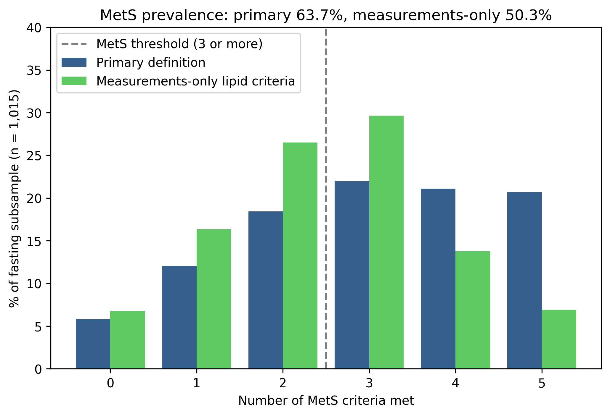

# Diet Quality, Metabolic Risk and Survival in Adults 50+ (NHANES 2011–2012)

## Summary

## Why this question

## Data and population

### Population

The analysis uses the 2011–2012 cycle of the National Health and Nutrition Examination Survey (NHANES), run by the US National Center for Health Statistics (NCHS), restricted to participants aged 50 and over. This cycle was chosen because NCHS links its participants to death records through the end of 2019 in a public-use mortality file, giving roughly eight years of follow-up. More recent cycles have too little follow-up for a survival analysis.

Diet is measured by the first-day 24-hour dietary recall. Participants are kept only if NHANES flags their recall as reliable (`DR1DRSTZ = 1`), and then only if their reported energy intake is plausible by the Willett cut-offs: 500–3,500 kcal for women, 800–4,000 kcal for men. The energy step removes 100 participants, 4.3% of those with a reliable recall.

### Sample flow

```
NHANES 2011–2012 participants                          9,756
  → aged 50 and over                                   2,704
  → record in the dietary file                         2,566
  → reliable recall (DR1DRSTZ = 1)                     2,306
  → plausible energy intake                            2,206   analytic sample
      │
      ├─ fasting glucose and triglycerides measured    1,015
      │    └─ complete covariates                        906   metabolic syndrome models,
      │                                                        prediction benchmark
      │
      └─ linked to mortality records                   2,202   440 deaths
           └─ complete covariates                      1,998   398 deaths, Cox model
```

The analytic sample of 2,206 divides according to what each analysis needs. The metabolic syndrome outcome requires fasting glucose and triglycerides, which 1,015 participants have; 906 of them have complete data on the model covariates, and the prediction benchmark uses the same 906. The survival analysis has no fasting requirement: it uses all 2,202 participants NCHS could link to mortality records (4 could not be linked for insufficient identifying data), of whom 440 (20.0%) died during follow-up. Among those still alive at the end of follow-up, the median follow-up is 96 months. By Kaplan–Meier estimate, 96.5% of the sample were alive at 2 years, 89.1% at 5 years and 79.5% at 8 years. The Cox model's complete cases number 1,998, with 398 deaths.

Almost all the loss at the complete-case steps is from missing household income: 104 of the 109 participants dropped from the metabolic syndrome models, and 198 of the 204 dropped from the Cox model. Methods describes how those dropped compared with those kept.

### Data files

The data are not redistributed in this repository. They are free to download from NCHS, and their use is governed by the [NCHS Data User Agreement](https://www.cdc.gov/nchs/policy/data-user-agreement.html), which a user accepts on download. The notebook reads the twelve files below from a folder named `data/` at the top level of the project.

| File | Contents | SHA-256 |
|---|---|---|
| [`BMX_G.xpt`](https://wwwn.cdc.gov/nchs/nhanes/search/datapage.aspx?Component=Examination&Cycle=2011-2012) | Body measures | `4814bfc3047ed400b9d43d285f8c3ea7c940ac6489404a9b699579715d158ec3` |
| [`BPQ_G.xpt`](https://wwwn.cdc.gov/nchs/nhanes/search/datapage.aspx?Component=Questionnaire&Cycle=2011-2012) | Blood pressure and cholesterol medication questions | `39c5a0ee1d76e6f3df867c0057986a21f4a028038002c43214c5af8bdec83cae` |
| [`BPX_G.xpt`](https://wwwn.cdc.gov/nchs/nhanes/search/datapage.aspx?Component=Examination&Cycle=2011-2012) | Blood pressure readings | `1dd66110f41465d601cd54f1e3c6010baafb9375f09fbcaa3aef2536876146fd` |
| [`DEMO_G.xpt`](https://wwwn.cdc.gov/nchs/nhanes/search/datapage.aspx?Component=Demographics&Cycle=2011-2012) | Demographics | `eaf0525d1952626885af3e935415a1f66ad62c18698080e7354789c125af252d` |
| [`DIQ_G.xpt`](https://wwwn.cdc.gov/nchs/nhanes/search/datapage.aspx?Component=Questionnaire&Cycle=2011-2012) | Diabetes questions | `a9d5475e0cd66d6a7bc30230345ed0172a9abcbc0a7a4145a35025c827a52a87` |
| [`DR1TOT_G.xpt`](https://wwwn.cdc.gov/nchs/nhanes/search/datapage.aspx?Component=Dietary&Cycle=2011-2012) | First-day total nutrient intakes | `d5589de4cd987eef86dd13b3b2bc3db9186ab80a87c96a3968421ddef9235c57` |
| [`GHB_G.xpt`](https://wwwn.cdc.gov/nchs/nhanes/search/datapage.aspx?Component=Laboratory&CycleBeginYear=2011) | Glycohemoglobin (HbA1c) | `8ff7cc95461fdfd47d2c9640b944a2bcd45926a3c0e64c98a09a4cef6c0f88d7` |
| [`GLU_G.xpt`](https://wwwn.cdc.gov/nchs/nhanes/search/datapage.aspx?Component=Laboratory&CycleBeginYear=2011) | Fasting glucose | `e9c3816dbdfc21cd53a23d63c3610d2550662ee41a21df0a5b72c4a16cd1a8fd` |
| [`HDL_G.xpt`](https://wwwn.cdc.gov/nchs/nhanes/search/datapage.aspx?Component=Laboratory&CycleBeginYear=2011) | HDL cholesterol | `ffc060d394cc487f3206462fdfc77648bdbdd6e279bfc5dd8e9cbba3ccdcac4f` |
| [`SMQ_G.xpt`](https://wwwn.cdc.gov/nchs/nhanes/search/datapage.aspx?Component=Questionnaire&Cycle=2011-2012) | Smoking questions | `69f2375f036a815082b1e97110e79c505b91e0985c61696f8eaacf94828115dc` |
| [`TRIGLY_G.xpt`](https://wwwn.cdc.gov/nchs/nhanes/search/datapage.aspx?Component=Laboratory&CycleBeginYear=2011) | Triglycerides | `4b7f9c73f5169f8bb582823d00a8e488d6985ea9d8784f85ee63ff60179589a0` |
| [`NHANES_2011_2012_MORT_2019_PUBLIC.dat`](https://ftp.cdc.gov/pub/Health_Statistics/NCHS/datalinkage/linked_mortality/) | Public-use linked mortality file (fixed-width text) | `ff98b6c87172643426b1c6d20f76495592bebd618ea18f742d98a44b84456b30` |

To check that downloaded files are identical to the ones this analysis used, run this in the folder that holds them (tested on macOS, zsh):

```
shasum -a 256 *.xpt *.dat
```

Each fingerprint in the output should match the table. The files are listed in the same order as the table.

### Mortality data

The mortality file comes from the NCHS public-use linked mortality files, which follow NHANES participants' vital status through the end of 2019. It is downloaded from the [NCHS linked mortality FTP directory](https://ftp.cdc.gov/pub/Health_Statistics/NCHS/datalinkage/linked_mortality/), which NCHS names as the authentic source of these files. Its fixed-width layout is described in the [NCHS data dictionary](https://www.cdc.gov/nchs/data/datalinkage/public-use-linked-mortality-files-data-dictionary.pdf).

The data are cited as NCHS asks:

> National Center for Health Statistics Division of Analysis and Epidemiology. Continuous NHANES Public-use Linked Mortality Files, 2019. Hyattsville, Maryland. Available from: `https://www.cdc.gov/nchs/data-linkage/mortality-public.htm`. doi:10.15620/cdc:117142.

The web page named in the citation now redirects to a general National Death Index page, so the FTP directory above is given as the download source and the DOI as the permanent identifier.

**Acknowledgement and disclaimer.** The linked mortality data are provided by the National Center for Health Statistics. The analyses, interpretations and conclusions in this repository are the author's alone; NCHS is responsible only for the initial data.

## Methods

The analysis is built in four layers, each completed before the next began:

1. **Diet quality score:** a nutrient-based score from the 24-hour dietary recall.
2. **Diet and metabolic syndrome:** cross-sectional logistic regression.
3. **Diet and mortality:** Kaplan–Meier curves and a Cox proportional hazards model over about eight years of follow-up.
4. **Prediction benchmark:** whether a flexible model predicts metabolic syndrome better than logistic regression.

### Diet quality score

The score follows the logic of DASH-style indices. Eight nutrients are scored: five that a healthy diet should be high in are rewarded (fibre, potassium, magnesium, calcium and vitamin C), and three it should be low in are penalised (sodium, saturated fat and total sugars). A nutrient-based index with published precedent was preferred to an invented one.

Each nutrient is first expressed as a density per 1,000 kcal, so that the score reflects what a diet is made of rather than how much was eaten. Densities are then divided into quintiles within the analytic sample and scored 1 to 5, reversed for the penalised nutrients so that a higher score always means a better diet. The eight component scores are summed with equal weight, giving a possible range of 8 to 40. The observed range is 10 to 37 (mean 24.0, SD 5.56).

Equal weighting was checked rather than assumed: no pair of components correlates above 0.8 (the highest, potassium with magnesium, is 0.71), so no component duplicates another.

Two candidate components were left out. Carotenoid intake on a single day depends heavily on whether a carotenoid-rich food happened to be eaten, so one recall ranks people's usual intake poorly. Protein does not distinguish diet quality without information on its food sources: 80 g from processed meat would score the same as 80 g from legumes.

Energy adjustment by density was chosen over the residual method (regressing each nutrient on total energy), which is equally standard but harder for a non-specialist to follow. A re-run with the residual method is deferred.

### Metabolic syndrome

Metabolic syndrome is defined by the harmonised criteria: a participant has it if they meet three or more of the five below. It is assessed on the 1,015 participants with fasting glucose and triglycerides.

| Criterion | Met if |
|---|---|
| Waist circumference | ≥ 102 cm (men), ≥ 88 cm (women) |
| Blood pressure | systolic ≥ 130 or diastolic ≥ 85 mmHg, or on blood pressure medication |
| Fasting glucose | ≥ 100 mg/dL, or diagnosed diabetes, or on diabetes medication |
| Triglycerides | ≥ 150 mg/dL, or on cholesterol medication |
| HDL cholesterol | < 40 mg/dL (men), < 50 mg/dL (women), or on cholesterol medication |

Medication is part of the definition because the harmonised criteria specify it, and leaving it out would bias this analysis in a predictable direction. People on treatment tend to have normal measurements and, having been advised to change their diet, better diets too. Counting them as unaffected would make good diets look more protective than they are.

Blood pressure is the mean of the second and third readings, since the first tends to be raised by the alerting response; where those are missing, whichever readings exist are used. Diagnosed diabetes means answering yes to the diabetes question (`DIQ010 = 1`); "borderline" does not count. Diabetes medication (insulin or oral agents) meets the glucose criterion even without a diagnosis, since the criteria refer to drug treatment, not diagnosis. In practice this matters little: in the fasting subsample, fasting glucose alone identifies 682 participants and the diagnosis and medication arms together add 6. Four "don't know" answers to medication questions are coded as not on medication.

Cholesterol medication needs more care. Following the harmonised wording, one "yes" to the cholesterol medication question satisfies both lipid criteria at once, so 380 of the 1,015 (37.4%) start with two criteria before any measurement is taken. The defence would be that low HDL and high triglycerides go together clinically, but in this sample they mostly do not: among the 635 participants not on cholesterol medication, only 72 (11.3%) meet both lipid criteria on their measurements. The question also asks about any cholesterol-lowering prescription, and in this age group most are likely statins, prescribed for LDL, which is not a metabolic syndrome component. The medicated definition is kept as primary because it follows the published criteria and standard practice in NHANES analyses. A measurements-only version of both lipid criteria is run alongside it as a pre-specified sensitivity analysis.

A four-criteria definition based on HbA1c, which needs no fasting sample and so could use all 2,206 participants, is deferred. It would be a substantive check rather than a formality, because the fasting subsample is not a random subset: morning attendance is related to employment, age and health.

### Covariates

The metabolic syndrome models and the Cox model adjust for the same six covariates, coded the same way and with the same reference levels, so that their results can be read side by side.

| Covariate | Coding | Reference |
|---|---|---|
| Age | three bands: 50–64, 65–74, 75+ | 50–64 |
| Sex | male, female | male |
| Education (`DMDEDUC2`) | 1 less than 9th grade; 2 9th–11th grade, including 12th grade with no diploma; 3 high school graduate or equivalent; 4 some college or AA degree; 5 college graduate or above | level 1 |
| Income (`INDFMPIR`) | ratio of family income to the poverty threshold, continuous | — |
| Smoking | never, former, current | never |
| Special diet (`DRQSDIET`) | on any special diet: yes, no | no |

Age is banded rather than entered as a number for a reason specific to NHANES: age is top-coded at 80, and 363 participants in the analytic sample carry that value whatever their true age. A continuous age term would treat them all as exactly 80.

Education is entered as categories rather than as a number, because the five levels are ordered but not evenly spaced; a single linear term would force a straight line across them. The three "don't know" answers are set to missing.

Smoking status is derived from the two NHANES smoking questions, `SMQ020` and `SMQ040`. Former and current smokers are kept apart rather than combined as "ever smoked", because that distinction matters for metabolic risk at these ages.

Special diets are adjusted for rather than excluded. Excluding them would remove people with metabolic disease non-randomly, the very people the outcome is about. A re-run excluding them is deferred.

Participants missing any covariate are excluded (complete-case analysis), and almost all of that loss is missing income, so those missing income were compared with those kept. For the metabolic syndrome models (104 missing income, 906 kept), prevalence was 63.5% against 63.8% and the mean diet score 24.32 against 23.87. For the Cox model (204 dropped, 1,998 kept), the death rate was 20.6% against 19.9% and the mean diet score 24.23 against 23.97. Both diet score differences are under a tenth of the score's standard deviation. The one visible difference is age: those dropped from the Cox model are somewhat older (25% against 20% aged 75 and over).

### Layer 2: diet and metabolic syndrome

Metabolic syndrome is modelled by logistic regression (`statsmodels`), with the diet score as the exposure and the six covariates above, on the 906 participants in the fasting subsample with complete data. The model is fitted twice, once with each outcome definition: the primary definition, in which cholesterol medication counts towards the lipid criteria, and the measurements-only sensitivity definition. Both fits use the identical 906 participants, so any difference between them comes from the outcome definition alone.

Coefficients are converted to odds ratios by exponentiating the estimate and both ends of its 95% confidence interval. The diet score's odds ratio is reported per one-point increase on the score. No alternative model specification was fitted after the result was seen.

Special diet is included to control confounding, not as an exposure of interest. People often adopt a special diet after a metabolic diagnosis, so its coefficient reflects reverse causation and is not interpreted as an effect.

The model does not test whether the diet association differs by age. An interaction term compares two slopes, each estimated on part of the sample, so its standard error would be roughly double that of the main effect; at n = 906 that test could not have been interpreted, and no subgroup estimates are reported in its place.

### Layer 3: diet and mortality

The outcome is death from any cause, from the NCHS public-use linked mortality file (`MORTSTAT`). Follow-up time is `PERMTH_EXM`, counted in whole months from the examination to death or to the end of follow-up on 31 December 2019. The examination is where the dietary recall was taken, so follow-up starts when the exposure was measured. Participants who did not die are all censored on that same date: censoring is administrative, and no one is lost to follow-up. One participant died in the month of their examination and has a follow-up time of zero; this is a real observation and is kept. The mortality file is fixed-width text, read with column positions derived from the data; Reproducibility describes how.

Survival is first described with Kaplan–Meier curves for the four quartiles of the diet score, compared with a log-rank test. Quartiles are used only because a Kaplan–Meier curve needs groups. They are unequal in size, because the score takes whole-number values and everyone with the same score must fall in the same group. This comparison is unadjusted and descriptive.

The adjusted estimate comes from a Cox proportional hazards model (`lifelines`), with the diet score as a continuous exposure and the same six covariates as Layer 2, on the 1,998 participants with complete data. The model has 398 deaths against 12 parameters, about 33 per parameter, well above the usual minimum of 10. The diet score's hazard ratio is reported per one-point increase and per standard deviation of the score in the model sample (5.603 points).

Because follow-up is recorded in whole months, deaths in the same month cannot be put in order: 425 of the 440 deaths (96.6%) share their month with at least one other. `lifelines` handles tied deaths with Efron's method, the only method it offers. Efron's method suits data like these, because the simpler Breslow approximation biases estimates towards no effect when many deaths are tied.

The proportional hazards assumption, that each covariate's effect stays constant over follow-up, was tested with Schoenfeld residuals (`check_assumptions`, threshold 0.05), and no covariate violated it. This is evidence against a violation rather than proof that none exists: with 398 deaths, a modest departure could go undetected.

### Layer 4: prediction benchmark

Layer 4 asks a narrower question: given the same inputs, does a flexible model predict metabolic syndrome better than logistic regression? It compares two modelling approaches on one prediction task; it is not intended as a clinical prediction tool. Both models use the same 906 participants as Layer 2, split once into a training set of 679 and a held-out test set of 227. The split is stratified, so both sets have the same prevalence, and uses a fixed random seed, so it is identical on every run.

The features are named explicitly as an allow-list: the eight nutrient densities, total energy intake, special diet and the five demographic covariates, 15 columns in all, which become 20 once categories are expanded into indicators. The main decision is what to leave out. Metabolic syndrome is defined by five criteria, so a model given the criterion flags would simply reconstruct the label. The measurements the flags are built from (waist, glucose, triglycerides, HDL and blood pressure) and the medication variables that form the "or on treatment" arms are excluded for the same reason, one step removed. BMI is excluded too, as a judgement call rather than leakage: it closely tracks waist circumference, so including it would mostly let the model approximate one criterion instead of testing whether diet and demographics predict the syndrome. An allow-list is used rather than removing known problem columns, because an allow-list cannot silently pick up a new column added elsewhere in the notebook.

Diet enters as the eight densities, not the diet score. The score compresses the densities through quintile cut-offs and fixed equal weights. Giving a flexible model the score would remove the structure it might exploit, and a finding that flexibility adds nothing would then follow from the input rather than from the data.

Both models are fitted with `scikit-learn`. The baseline is logistic regression without a penalty, the same form of model as Layer 2, used here for prediction. Its features are standardised with means and standard deviations taken from the training set only; for an unpenalised model this cannot change the predictions and only helps the fitting routine converge. The comparison model is gradient boosting with the library's documented default settings and a fixed random seed. Neither model is tuned: tuning only the flexible model would tilt the comparison towards it, and tuning both properly needs cross-validation within the training set, which is outside this version's scope.

The models are compared by AUC on the test set: the probability that a randomly chosen participant with metabolic syndrome is ranked above a randomly chosen participant without it. Accuracy is not reported. With a prevalence of 63.9% in the test set, labelling everyone as positive is already 63.9% accurate, and at the default 0.5 cut-off the logistic model labels 81.1% of the test set positive, so accuracy would mostly measure the base rate. Before the gradient boosting result was seen, the smallest difference in test AUC that would count was fixed at 0.03–0.04, about the sampling error of an AUC on 227 people. Calibration, whether predicted probabilities match observed rates, was not assessed; Limitations explains why.

### Survey design

NHANES is a complex, multi-stage sample: participants are selected in clusters (primary sampling units) within strata, some groups are deliberately oversampled, and each participant carries a sampling weight. This version of the analysis is unweighted and does not use the strata or clusters. Its estimates therefore describe the participants analysed here rather than the US population aged 50 and over: the prevalences reported in this README are sample figures, not national estimates. Its standard errors also ignore the clustering and are likely to be too narrow.

This was a deliberate choice for the first version: an unweighted analysis with the limitation stated openly, rather than a weighted one that might not be finished. A weighted reanalysis is planned as a later version. It would use the first-day dietary weight (`WTDRD1`) and, for analyses restricted to the fasting subsample, the fasting subsample weight (`WTSAF2YR`).

## Results

All estimates are unweighted; see Survey design under Methods.

### Diet and mortality

Over follow-up, 440 of the 2,202 participants in the survival sample died. Unadjusted survival by diet-score quartile (Figure 1) differs across the four groups (log-rank χ² = 9.711, df = 3, p = 0.0212), but not as a gradient: the three lower quartiles overlap throughout and finish within about two percentage points of each other, while the top quartile separates from about month 40 and ends about five percentage points above them. The pattern is a top-quartile contrast.


**Figure 1.** Kaplan–Meier survival by diet-score quartile, survival sample (n = 2,202, 440 deaths). The y-axis starts at 0.60, not 0, to make the differences visible. The diet score is relative to this sample, so the top quartile means a better diet than other participants', not a diet meeting any external standard. The curves are unadjusted; the adjusted estimate is the Cox model below. As participants are censored, fewer remain at risk and the curves become less certain towards the right.

In the Cox model, adjusted for age, sex, education, income, smoking and special diet, each one-point increase in the diet score is associated with a 2.9% lower rate of death: **hazard ratio 0.971 per point (95% CI 0.953–0.989, p = 0.002)**. Per standard deviation of the score (5.603 points in the model sample), the hazard ratio is **0.848 (0.764–0.941)**: a one-SD better diet is associated with about a 15% lower rate of death over eight years of follow-up. This is the project's headline result.

| Term | HR | 95% CI | p |
|---|---:|:---:|---:|
| age 65–74 (vs 50–64) | 2.747 | 2.061–3.662 | <0.0005 |
| age 75+ (vs 50–64) | 9.335 | 7.187–12.124 | <0.0005 |
| female (vs male) | 0.657 | 0.531–0.812 | <0.0005 |
| education 2 (vs 1) | 1.525 | 1.102–2.110 | 0.011 |
| education 3 (vs 1) | 1.239 | 0.907–1.693 | 0.178 |
| education 4 (vs 1) | 1.070 | 0.773–1.480 | 0.684 |
| education 5 (vs 1) | 0.670 | 0.449–0.998 | 0.049 |
| current smoker (vs never) | 1.618 | 1.206–2.170 | 0.001 |
| former smoker (vs never) | 1.128 | 0.900–1.414 | 0.296 |
| special diet | 1.162 | 0.885–1.527 | 0.279 |
| income-to-poverty ratio | 0.887 | 0.821–0.958 | 0.002 |
| **diet score (per point)** | **0.971** | **0.953–0.989** | **0.002** |

*Cox proportional hazards model, n = 1,998, 398 deaths.*

The covariates behave as expected for mortality. Risk rises steeply and in order with age, to more than nine times the youngest band's rate at 75 and over. Women have a lower rate than men, current smokers a higher rate than never-smokers (former smokers do not differ), and higher income is associated with lower mortality. Education does not follow a gradient: the highest level (college graduate or above) is associated with lower mortality, but level 2 has a *higher* rate than level 1, and levels 3 and 4 do not differ from it. No explanation for level 2 is offered; it is reported as observed. Special diet, the largest term in the metabolic syndrome models, shows no association with mortality.

The model's concordance of 0.780 comes almost entirely from age and is not evidence for the diet score.

### Diet and metabolic syndrome

In the fasting subsample, 63.7% (647 of 1,015) meet the primary definition of metabolic syndrome and 50.3% (511) the measurements-only definition.

The diet score is not significantly associated with metabolic syndrome under either definition: **odds ratio 0.976 per point (95% CI 0.951–1.003, p = 0.080)** under the primary definition and **0.978 (0.954–1.003, p = 0.090)** under measurements-only, in the same 906 participants. Both estimates point towards lower odds with a better diet, but both intervals include 1, and the result is reported as a null.

| Term | Primary: OR (95% CI) | p | Measurements-only: OR (95% CI) | p |
|---|---:|---:|---:|---:|
| age 65–74 (vs 50–64) | 2.086 (1.466–2.970) | <0.001 | 1.408 (1.017–1.947) | 0.039 |
| age 75+ (vs 50–64) | 1.722 (1.180–2.514) | 0.005 | 1.542 (1.079–2.205) | 0.017 |
| female (vs male) | 1.159 (0.860–1.564) | 0.332 | 1.224 (0.921–1.627) | 0.164 |
| education 2 (vs 1) | 1.033 (0.588–1.818) | 0.909 | 1.226 (0.726–2.068) | 0.446 |
| education 3 (vs 1) | 0.980 (0.589–1.630) | 0.937 | 1.008 (0.630–1.612) | 0.974 |
| education 4 (vs 1) | 0.757 (0.455–1.261) | 0.286 | 1.171 (0.728–1.884) | 0.516 |
| education 5 (vs 1) | 0.465 (0.271–0.799) | 0.006 | 0.712 (0.427–1.187) | 0.193 |
| current smoker (vs never) | 0.967 (0.638–1.465) | 0.875 | 0.989 (0.662–1.476) | 0.955 |
| former smoker (vs never) | 1.157 (0.830–1.612) | 0.389 | 1.113 (0.814–1.523) | 0.502 |
| special diet | 2.765 (1.805–4.234) | <0.001 | 2.738 (1.878–3.992) | <0.001 |
| income-to-poverty ratio | 1.102 (0.996–1.218) | 0.059 | 1.044 (0.949–1.149) | 0.374 |
| **diet score (per point)** | **0.976 (0.951–1.003)** | **0.080** | **0.978 (0.954–1.003)** | **0.090** |

*Logistic regression, n = 906 under both definitions. The special diet odds ratio reflects reverse causation (special diets are adopted after a metabolic diagnosis) and is not an effect.*

Figure 2 sets these estimates beside the Cox hazard ratio. The two analyses agree in direction, and only the mortality interval excludes 1. They should not be compared number to number: an odds ratio and a hazard ratio are different measures, and with metabolic syndrome at 63.7% prevalence the odds ratio overstates the corresponding risk ratio, so the metabolic syndrome association is weaker than its odds ratio suggests. The simplest reading of the difference is power: the mortality analysis has 1,998 participants and 398 timed deaths, against a yes/no outcome in 906. A pathway difference, with diet related to mortality other than through metabolic syndrome, cannot be excluded from these results, but neither can it be claimed.


**Figure 2.** Diet-score estimates per one-point increase, with 95% confidence intervals. Panel A: odds ratios for metabolic syndrome under the two definitions (n = 906). Panel B: hazard ratio for death (n = 1,998, 398 deaths). Both models adjust for the same covariates. Odds ratios and hazard ratios are different measures, so they are drawn on separate axes and should be read for direction and precision, not compared number to number; at 63.7% prevalence the odds ratio overstates the corresponding risk ratio. Both metabolic syndrome intervals include 1; the mortality interval does not.

The two definitions differ in more than prevalence (Figure 3). Under measurements-only, the number of participants falls away past the threshold: 301 meet three criteria, 140 four and 70 five. Under the primary definition, the counts at three, four and five criteria are almost level (223, 214 and 210), because one "yes" to cholesterol medication switches on two criteria at once. 136 participants (13.4%) meet the primary definition only; no one meets the measurements-only definition without also meeting the primary one, as expected, since removing a criterion arm can only lower a count.



**Figure 3.** Number of metabolic syndrome criteria met in the fasting subsample (n = 1,015), as a percentage of the subsample, under the primary and measurements-only definitions. The dashed line marks the threshold of three criteria. Under the primary definition, one "yes" to cholesterol medication satisfies both the HDL and the triglyceride criterion; 136 participants (13.4%) meet the definition only because of that. The diet-score association did not change between definitions (odds ratio 0.976 against 0.978).

Changing the definition leaves the diet score unchanged but moves other terms, in an informative way. Education level 5 goes from 0.465 (p = 0.006) to 0.712 (p = 0.193), and income from 1.102 (p = 0.059) to 1.044 (p = 0.374). Both are markers of healthcare contact, and a statin prescription needs a doctor, a lipid test and follow-up: under the primary definition, education and income were partly predicting who had been prescribed a statin rather than who had metabolic dysfunction. This accounts for most of the counterintuitive positive income association; in the mortality model, which has no prescription arm, income runs in the expected direction (hazard ratio 0.887). The age terms also attenuate, and the primary definition's pattern of higher odds at 65–74 than at 75+ does not survive the change of definition: under measurements-only, odds rise in order with age. Special diet is unchanged (2.765 against 2.738), consistent with its reflecting the underlying condition rather than how the outcome is defined.

### Prediction benchmark

| Model | Training AUC | Test AUC | Gap (training − test) |
|---|---:|---:|---:|
| logistic regression (unpenalised) | 0.662 | **0.663** | −0.001 |
| gradient boosting (default settings) | 0.990 | **0.618** | +0.372 |

*Training set n = 679, test set n = 227; both models receive the same 20 features.*

On the 227 held-out participants, logistic regression reaches a test AUC of 0.663 and gradient boosting 0.618. The difference, −0.045, falls outside the 0.03–0.04 band fixed before the gradient boosting result was seen: the flexible model gained nothing over the linear one. It should not be read as significantly worse; that would need a paired comparison, and a single split of 227 cannot establish it.

The more telling result is the gap between training and test performance. Logistic regression does as well on participants it has not seen as on those it was fitted to (−0.001). Gradient boosting reaches 0.990 on the training set and loses almost all of that advantage on the test set (+0.372). The linear model's form does not let it memorise individual participants; the flexible model's does, and it did.

The training AUC of 0.990 is memorisation, not leakage of the outcome into the features, and this can be checked rather than asserted. Logistic regression received the identical 20 features and reached only 0.662 on the same training participants. A leaked outcome needs no flexibility to exploit, since a single coefficient would find it, so if the label were present in the features the linear model would have found it too. With eight continuous nutrient densities, energy intake and income, each participant has an effectively unique combination of values, and a hundred sequential trees can divide the training set finely enough to classify almost every participant correctly. None of that carries over to new participants.

At a test AUC of 0.663, the model is not a screening tool and is not offered as one: its purpose is the comparison between the two approaches.

## Limitations

### Measuring diet

**One day of intake stands in for usual diet.** The score is built from a single 24-hour recall per person, so it ranks people by what they ate on one day, not by what they usually eat. Day-to-day variation of this kind blurs the ranking, and I would expect it to pull estimates towards no association rather than away from it. I kept recalls with very low intakes of individual nutrients, because they are plausible single-day intakes and passed NHANES's own reliability flag: two participants had near-zero fibre (one reported a single food item providing 1,736 kcal, likely alcohol) and 37 had no vitamin C.

**Intake is self-reported, and self-reported intake is known to fall below measured expenditure,** more so in older adults and at higher BMI. Every nutrient figure here is reported intake.

**The sugar component is total sugars, not added sugars.** The variable available in the dietary file (`DR1TSUGR`) includes sugars from fruit and dairy, so the penalised sugar component penalises some foods it should not.

**Calcium is the weakest component.** It correlates 0.18 with saturated fat, so it partly measures dairy intake rather than diet quality.

**Protein is not scored.** Total protein does not separate quality without food groups: 80 g from processed meat scores identically to 80 g from legumes. Protein arguably belongs in the score as a rewarded component for adults over 50, given the risk of sarcopenia. I decided against it and did not test the alternative, so a score that rewards protein is a defensible variant I have not run.

**The score is relative to this sample.** Components are scored by quintile within the analytic sample, so a high score means high relative to other US adults aged 50 and over here, not high against an absolute standard. The observed range is 10 to 37 out of a theoretical 8 to 40, and scores cannot be compared directly with those from other studies.

### Defining the outcome and the sample

**Missing waist circumference is counted as the criterion not met, which biases metabolic syndrome prevalence downward.** Waist is missing for 113 of the 2,206 participants, 39 of them in the fasting subsample. Only 23 of the 113 are also missing BMI, so 90 had body measurements taken but not waist specifically. Waist measurement requires standing and placing a tape, so it is likely to be missed more often in people with limited mobility or severe obesity, who are more likely, not less, to meet the criterion. The bias therefore has an expected direction: prevalence is slightly understated.

**One questionnaire answer can satisfy two of the five criteria.** In the primary definition, taking cholesterol medication meets both the low-HDL and the high-triglyceride criterion. 380 of the 1,015 in the fasting subsample (37.4%) take cholesterol medication, so they start two criteria towards the threshold of three before any measurement is taken. The usual defence is that low HDL and high triglycerides occur together, but the data here do not support it: among the 635 unmedicated participants, only 72 (11.3%) meet both lipid criteria on measurements alone. This is why the measurements-only definition is reported alongside the primary one, and why the two prevalences differ as much as they do (63.7% and 50.3%).

**Many participants sit close to the threshold.** 410 of the 1,015 (40.4%) meet exactly two or three criteria, within one criterion of the cut-off. Metabolic syndrome status in this sample is sensitive to definitional choices rather than robust to them.

**Income has non-response and is top-coded.** The family income-to-poverty ratio (`INDFMPIR`) is missing for 104 of the 1,015 in the fasting subsample and 198 of the 2,202 in the survival sample, and those participants drop out of the models. Compared with those retained, they are similar in metabolic syndrome prevalence, death rate and diet score, and modestly older. That comparison can only test what was measured, so non-response may still be related to income itself. The ratio is also top-coded at 5.00, meaning family income at or above five times the poverty threshold, which compresses differences among higher-income participants. Both problems make the adjustment for income less complete, which can leave some residual confounding by income in the diet-score estimates.

**Age is top-coded at 80.** 363 participants carry the value 80, and their true ages are 80 or over. Modelling age in three bands (50–64, 65–74, 75+) avoids treating all of them as exactly 80, but age is not adjusted for within each band. In the survival model, where age accounts for most of the predictive power, some residual confounding by age within bands is possible.

### What the results can support

**These are associations, not effects.** The data are observational, and people with better diets may differ from others in ways the covariates do not capture. The metabolic syndrome analysis is also cross-sectional: diet and metabolic status are measured at the same visit, so a diagnosis can change diet rather than the other way round. The special-diet covariate shows this directly. It is the largest term in the metabolic syndrome model (OR 2.77) because special diets are adopted after a diagnosis, and it is included to control for that, not as a finding.

**The metabolic syndrome result is a null, not evidence of no association.** A single-day exposure against a binary outcome in 906 participants has limited power to detect a small association. The interval (0.951 to 1.003 per point) is compatible both with a small protective association and with none.

**The two layers agree in direction, not necessarily in size.** The odds ratio and the hazard ratio are different measures, and at 63.7% prevalence an odds ratio overstates the corresponding risk ratio, so the two estimates are not compared number to number. The survival analysis carries more information (398 deaths with their timing, against a yes/no outcome in 906), which is the simpler explanation for its interval excluding 1 when the metabolic syndrome interval does not. A difference in pathway, with diet related to mortality through routes other than metabolic syndrome, cannot be excluded.

**The Kaplan–Meier curves are unadjusted.** Figure 1 and the log-rank test compare diet quartiles without adjusting for age or anything else, and the quartiles are unequal (648, 503, 520 and 531 participants) because many participants share the same integer score. The adjusted estimate comes from the Cox model.

**Part of the metabolic syndrome model tracks healthcare contact, not metabolism alone.** When the cholesterol-medication arm is removed from the definition, the education and income terms weaken (see Results). Being prescribed a statin requires a doctor, a lipid test and follow-up, so under the primary definition these terms partly predict being diagnosed and treated.

**One covariate pattern is unexplained.** In the Cox model, education level 2 has a higher hazard than level 1 (HR 1.525, 1.102 to 2.110, p = 0.011), while levels 3 and 4 do not differ from level 1. I report this as observed and do not offer an explanation.

**The study is not powered for subgroups, and none was analysed.** Split by age band, the 75+ group would have had roughly six outcome events per model parameter, below the conventional minimum of ten, so any estimate there would have been unstable.

### The mortality data and the prediction benchmark

**Some follow-up times are synthetic.** In the public-use mortality file, NCHS replaces follow-up time with synthetic values for an unspecified subset of records to reduce the risk of disclosure, and does not say which records or how many. Vital status is not altered, so every death count stands, but the Kaplan–Meier and Cox estimates rest partly on substituted durations that cannot be identified or excluded.

**Discrimination was assessed, calibration was not.** AUC measures whether the model ranks participants with metabolic syndrome above those without. Calibration measures whether its predicted probabilities match observed rates, and that matters only when a predicted probability will be acted on, for example as a clinical cut-off or a risk score. At a test AUC of 0.663 this model has no such use: the benchmark exists to ask whether a flexible model finds more in these features than a linear one, not to produce a usable score.

**The benchmark rests on one train/test split with default settings.** Both models were evaluated once, on 227 held-out participants, and gradient boosting was run with its default settings, without tuning. Before seeing the result, I fixed a difference of about 0.03 to 0.04 in AUC as the smallest that would count at this test-set size. A different split, or a tuned model, could give different numbers, which is why the result is stated as no gain from the flexible model and not as the flexible model being worse.

### Who the results apply to

**The analysis is unweighted, so its numbers describe this sample, not the US population.** NHANES is designed to represent the US population only when its survey weights are applied, and the analysis does not use them, as Methods explains. The 63.7% metabolic syndrome prevalence is therefore the prevalence in this sample, not an estimate for US adults aged 50 and over. The confidence intervals also treat participants as independent, ignoring the survey's clustered design, so they may be too narrow.

**The data are from one US survey cycle.** Diet was measured in 2011–2012, and both diets and the population's health differ between countries. Whether the associations hold in European populations of the same age has not been tested here; What I'd do next names a candidate dataset.

## What I'd do next

### Analyses planned and deferred

**The four analyses Methods names as deferred were planned, and set aside to finish version 1, not dropped.** Each is defensible to run; none has been run.

1. **HbA1c-based metabolic syndrome on the full sample.** The primary definition needs fasting blood, which limits Layer 2 to the fasting subsample of 1,015, and that subsample is not random. A four-criteria definition using HbA1c would cover all 2,206 participants and show whether the result depends on who attended a morning appointment.
2. **Excluding participants on a special diet.** Special diets are adjusted for rather than excluded, because excluding them would remove people with metabolic disease non-randomly. Re-running without them would check that the diet-score estimates do not rest on people whose diet likely changed after a diagnosis.
3. **Energy adjustment by the residual method.** The score uses nutrient density per 1,000 kcal, chosen because it is easier to explain. The residual method is equally standard; re-running with it would show whether the results depend on that choice.
4. **Calibration of the Layer 4 models.** Only discrimination was assessed; Limitations explains why calibration was not. It would matter if the predicted probabilities were ever used to make decisions about individuals.

### Weighting the analysis

**The analysis is unweighted; a weighted reanalysis was planned from the start as the next version.** NHANES is a multi-stage sample with weights, strata and primary sampling units, and Methods explains why version 1 does not use them. The weighted version would use the dietary day-one weight, `WTDRD1`, for analyses built on the dietary sample, and the fasting-subsample weight, `WTSAF2YR`, for the fasting subsample, rather than the examination weight.

**One conflict in the survival model has to be resolved before that.** For sampling weights, the `lifelines` documentation recommends `robust=True` to get accurate standard errors, and also states that `robust=True` does not handle tied event times, with results that may differ materially when ties are numerous. Follow-up is recorded in whole months, and 425 of the 440 deaths in the survival sample (96.6%) share their month with at least one other death. How to reconcile the two is an open question for the weighted version, not a setting to accept.

### Questions these data could answer

**Whether the diet-score association differs by age.** No age-band analysis was run: an interaction term's standard error is roughly double that of the main effect, and the Layer 2 main effect was already not significant. Fitting the interaction anyway and reporting its confidence interval as a bounded null would show which sizes of difference between age groups the data can still rule out.

**Cause-specific mortality.** The mortality file also records the leading underlying cause of death (`UCOD_LEADING`) and two further cause-of-death variables, `DIABETES` and `HYPERTEN`, so deaths could be modelled by cause. Each cause would be a new outcome with fewer events than all-cause mortality, and so its own power problem. NCHS also substituted synthetic values for the underlying cause of death, not only for follow-up time, in some records of the public-use file. One practical trap: `pd.read_fwf` infers `UCOD_LEADING` as a number and drops the leading zeros of its codes, so it would need `dtype=str`.

**Tuning both Layer 4 models.** The logistic model ran unpenalised and gradient boosting ran with its defaults. Tuning only the flexible model would tilt the comparison toward it, so both would be tuned, by cross-validation inside the training set and never against the test set. For gradient boosting, `max_depth` and the `learning_rate` / `n_estimators` pair are where it would start. Until then, "no gain" holds for the default model only.

**A score that rewards protein.** Protein was left out of the diet score because total protein does not distinguish its sources: 80 g from processed meat scores the same as 80 g from legumes. For adults over 50 there is a case for rewarding it anyway, given the risk of age-related muscle loss. A variant score with protein as a rewarded component would show whether that choice changes the results.

**Imputing waist circumference from BMI.** Where waist was not measured (113 of the 2,206, and 39 of the fasting subsample) the waist criterion was counted as not met. Waist is more often skipped for people with mobility limitations or severe obesity, so this likely biases metabolic syndrome prevalence slightly downward. Most of those missing waist (90 of 113) had BMI measured, and the two correlate strongly, so waist could be imputed from BMI; that is a modelling choice needing its own justification, for a gain of 39 participants in the primary sample.

### Beyond these data

**Sarcopenia could be studied only in the youngest part of this sample.** In NHANES 2011–2012, whole-body DXA scans, which measure lean mass, were given only to participants aged 8 to 59 ([NHANES DXX_G documentation](https://wwwn.cdc.gov/Nchs/Data/Nhanes/Public/2011/DataFiles/DXX_G.htm)). The 50–59-year-olds in this sample were eligible; no one aged 60 or over was, and that is the age range in which muscle loss would be expected to matter most.

**A European test would use SHARE, and it would be a related study, not a replication.** SHARE (the Survey of Health, Ageing and Retirement in Europe) interviews adults aged 50 and over in 28 European countries and Israel. Studies using it describe its diet data as how often people eat a few food groups ([Maltarić et al., 2025](https://doi.org/10.3390/nu17152525)), so this diet score, built from a 24-hour recall, could not be rebuilt from it. Its blood markers come from non-fasting dried blood spots collected at home in 2015 in eleven European countries and Israel; they include HbA1c, triglycerides and HDL cholesterol but not fasting glucose ([Börsch-Supan et al., 2026, preprint](https://www.medrxiv.org/content/10.64898/2026.01.28.26344911v1)), so the metabolic syndrome definition used here could only be approximated. Deaths are confirmed through a proxy during fieldwork, and SHARE notes that without a national mortality register in most European countries it cannot reliably establish whether non-respondents are still alive ([SHARE FAQ](https://share-eric.eu/data/faqs-support)); the NHANES deaths used here come from linkage to the US National Death Index. What SHARE could likely test is whether a simpler, frequency-based measure of diet quality relates to mortality in older Europeans.

## Reproducibility

### Running the notebook

**The analysis runs on Python 3.9.6 with the package versions pinned in `requirements.txt`.** The file pins the six libraries the notebook imports (pandas, NumPy, matplotlib, statsmodels, lifelines and scikit-learn) and the `jupyter` package that runs it. Their own dependencies are not pinned, so pip installs the newest versions that fit: a fresh install on 24 September 2026 installed `jupyterlab` 4.5.11, where the original environment has 4.5.10.

**These commands download the repository and build the environment on macOS:**

```bash
git clone https://github.com/vasileva-ekaterina/nhanes-diet-metabolic-ageing.git
cd nhanes-diet-metabolic-ageing
python3 -m venv .venv
source .venv/bin/activate
pip install -r requirements.txt
```

**The data files are not in this repository and have to be added before the notebook can run.** Data and population lists the twelve files the notebook reads, with links to NCHS and SHA-256 checksums to confirm each download. Put all twelve in a folder named `data` inside the project folder, next to `analysis.ipynb`. The notebook reads them by relative paths such as `data/DEMO_G.xpt`, so it must also be run from the project folder.

**Then run every cell in order, in a fresh kernel:**

```bash
jupyter nbconvert --to notebook --execute analysis.ipynb --output analysis_rerun --ExecutePreprocessor.timeout=600
```

This writes the re-run notebook, with its new outputs, to `analysis_rerun.ipynb`, leaving `analysis.ipynb` unchanged; the timeout allows each cell up to ten minutes. Opening `analysis.ipynb` in VS Code, where it was developed, and running all cells does the same.

**This has been tested from a clean start, on macOS only.** On 24 September 2026 the repository was cloned into an empty folder, the packages were installed from `requirements.txt` into a new environment, and the notebook was run with the command above. Every printed output matched the committed notebook apart from model-fitting timestamps and the blank lines between outputs, and the three figures were byte-for-byte identical. On Linux the same commands would be expected to work unchanged; on Windows the activation command differs. Neither has been tried.

**The repository holds the notebook with its outputs, the three figures, this README and `requirements.txt`.** The data files and the virtual environment are not included; `.gitignore` keeps both out.

### Reading the mortality file

**The mortality file is fixed-width text, and its column positions had to be worked out.** Each record in `NHANES_2011_2012_MORT_2019_PUBLIC.dat` is one line, and each variable occupies a fixed range of character positions. The NCHS data dictionary gives the variables' order, types and codes but not their positions, and no read-in program came with the download. Column positions were derived by profiling character classes across all 9,756 records, and validated by internal consistency checks: codes within their documented ranges, missing counts matching the data dictionary's definitions, and every record linking on `SEQN`. NCHS also publishes SAS, Stata and R read-in programs, which were not used.

**Lines are 46 to 48 characters long, and that is expected.** Trailing blanks are trimmed, so a record whose last fields are missing is shorter. The positions are counted from the left, and `pandas.read_fwf` reads a range that runs past the end of a short line as missing, which is correct. The positions used are in the notebook's `colspecs`.

### Missing values that the obvious test misses

**Four times, a missing or zero value was stored in a form that the obvious check did not catch, and each time the wrong result looked normal.** They are described as observed with the versions in `requirements.txt`. patsy, which statsmodels uses to read model formulas, is installed as a dependency and not pinned, so its behaviour could differ in other versions.

**A diastolic reading of 0 is stored as `5.397605e-79`, which `== 0` does not catch.** The NHANES blood pressure codebook allows a diastolic reading of 0 without saying what it means. Read from the XPT file with `pandas.read_sas`, each 0 arrives as this near-zero number, so a test for equality with zero finds nothing, while a two-decimal display shows `0.00`. A 0 is not a plausible resting pressure to average with real readings, so readings below 1 were masked as missing, using a threshold rather than an equality test. Before the fix, 35 blood pressure averages had been corrupted: a reading of 78 averaged with a 0 gives 39.

**The same number in `INDFMPIR` is a genuine zero and was left alone.** The family income-to-poverty ratio's minimum is also `5.397605e-79`, and 14 participants in the analytic sample fall below one millionth. The DEMO_G codebook gives the range as 0 to 4.99, codes missing separately, and a ratio of 0 is a meaningful value. Masking it by analogy with the diastolic readings would have removed the 14 poorest participants. The near-zero number comes from the file format; whether a 0 means "zero" or "no usable value" is a separate question for each variable.

**`pd.NA` was not treated as missing by patsy.** Two recodes set missing values with `pd.NA` rather than `np.nan`, which turned the columns into `object` dtype. The Layer 2 model then failed with `TypeError: boolean value of NA is ambiguous`, raised while patsy built the categorical levels, and the message did not name the column. Replacing `pd.NA` with `np.nan` fixed it, with every missing count unchanged. An unexpected `object` dtype on a numeric column is the sign to look for.

**`pd.get_dummies` turns a missing category into the reference level.** By default it gives a missing value 0 in every indicator column, and with `drop_first=True` a row of zeros is exactly how the reference level is encoded. One participant missing smoking status became a never-smoker and one missing education became education level 1, and a `.dropna()` afterwards found nothing to remove. It was caught only because the Layer 4 frame had 908 complete cases against Layer 2's 906 on the same fasting subsample. Missing values are now dropped before encoding.

### A library default that changes the model

**scikit-learn's `LogisticRegression` is penalised unless told otherwise.** Called with no arguments, it applies L2 regularisation at `C=1.0`, which shrinks every coefficient towards zero; the class docstring says so, but the call itself gives no sign of it. In scikit-learn 1.6.1, as pinned, `LogisticRegression().get_params()` shows `'penalty': 'l2'` and `'C': 1.0`. `C=1.0` is a hyperparameter, and choosing it properly would need cross-validation within the training set, so the baseline described in Methods is fitted with `penalty=None`. Train and test AUC differ by 0.001, so there was no overfitting for a penalty to correct.

**The default also changes what standardisation does.** Methods notes that standardising the features cannot change an unpenalised model's predictions. Under the default penalty it would: a feature's scale decides how hard its coefficient is shrunk, so the same data in different units would give a different model.
